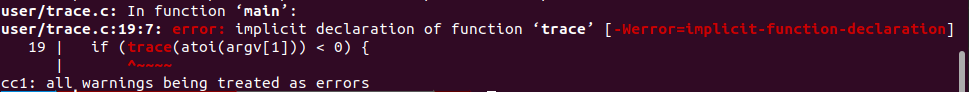
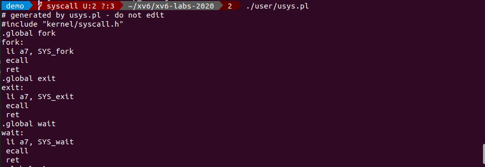

1. 在Makefile里增加 $U/_trace
2. 执行*make qemu*命令,你将会看到文件*user/trace.c*不能编译。
   (because the user-space stubs for the system call don't exist yet: add a prototype for the system call to user/user.h, a stub to user/usys.pl, and a syscall number to kernel/syscall.h)
   这是文档中的原句，这里翻译成中文可能会影响到理解。其实这里如果c语言的语法过关的话，也可以从c语言语法的角度去理解。
   首先我们看需要编译的文件*user/trace.c*,和报错信息。
   
   通过报错信息,可以知道是代码编译的时候找不到*trace*这个函数。所以需要我们去定义这个函数。文档要求我们去*user/user.h*定义。ok，我们添加函数的定义。
   
   ```c
   int trace(uint);
   ```
   到了这里编译是可以通过的，但是链接还是有点问题，因为没有实现*trace*这个函数，所以不知道怎么链接*trace*这个符号。想到这里问题转换为怎么实现这个函数，其实如果是普通的函数，我们可以像平常一样去添加这个函数实现的代码。但是这个函数不一般。它是系统调用。(system call), system call可以实现*用户态*到*内核态*的执行。为了生成这样的指令，xv6给我们提供了脚本文件usys.pl,单独执行usys.pl。
    
   阅读Makefile文件，可以看到，Makefile把*usys.pl*输出的内容重定向到*usys.S*。
   
   ```Makefile
   $U/usys.S : $U/usys.pl
        perl $U/usys.pl > $U/usys.S
   ```
   在usys.pl和syscall.h中添加需要代码。
   (The Makefile invokes the perl script user/usys.pl, which produces user/usys.S, the actual system call stubs, which use the RISC-V ecall instruction to transition to the kernel. Once you fix the compilation issues, run trace 32 grep hello README; it will fail because you haven't implemented the system call in the kernel yet.)


3. Add a sys_trace() function in kernel/sysproc.c that implements the new system call by remembering its argument in a new variable in the proc structure (see kernel/proc.h).  
   在kernel/sysproc.c里添加函数sys_trace().这个系统调用需要保存在结构体proc中的新变量。(这里有点不好理解。)
   
4. The functions to retrieve system call arguments from user space are in kernel/syscall.c, and you can see examples of their use in kernel/sysproc.c.  
   这个函数在kernel/syscall.c里获取来自用户态的系统调用参数。参考：
   sys_sleep, sys_kill等函数，可以知道用户态的调用参数可以通过下面的函数获取。
   ```c
   if(argint(0, &n) < 0)
   ```

5. Modify fork() (see kernel/proc.c) to copy the trace mask from the parent to the child process.  
   
6. Modify the syscall() function in kernel/syscall.c to print the trace output. You will need to add an array of syscall names to index into.  